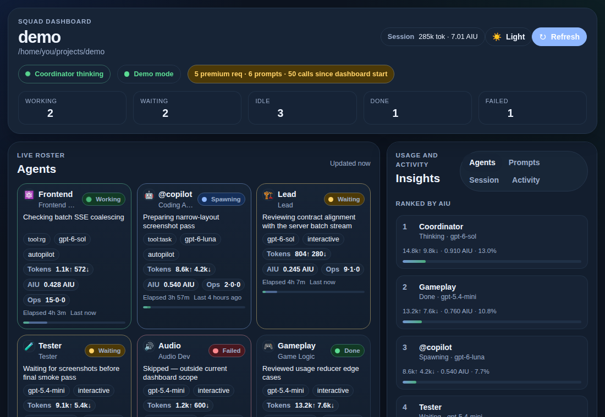

# Squad Dashboard

A live Copilot canvas for [Squad](https://github.com/bradygaster/squad) projects. It shows your AI agent team at a glance: who is working, what they are doing, and how many tokens and AIU they have used.



## Features

- **Live roster** of Squad members and spawned sub-agents, with statuses: working, spawning, waiting, idle, done and failed. The coordinator's state is shown in the header.
- **Compact cards** showing the current task, tool, model, token and AIU totals, operation counters (tool calls, completed, failed) and elapsed time.
- **Usage insights** for tokens and AIU per agent, per prompt and per session, plus by-model rollups. USD is shown only when you configure a rate.
- **Activity feed** of recent session events and `.squad/` file changes (decisions, logs, orchestration).
- **Dark/light toggle**, saved in `localStorage` and otherwise following the host theme.
- **Demo mode:** append `?demo=1` to the canvas URL to load `ui/demo-snapshot.json` with simulated updates instead of live session events. This also works when `ui/` is served by any static file server.

## Install

See [Install / load](../../README.md#install--load) in the root README: a `curl`/`tar` or `npx degit` one-liner, project scope, or a GitHub or gist URL in the Copilot app.

## Open the canvas

Ask Copilot to *"open the Squad Dashboard canvas"* (canvas ID `squad-dashboard`). You can optionally pass an input:

```json
{ "projectPath": "/path/to/project" }
```

The project is found by walking up from `input.projectPath`, then the session's working directory, then the process working directory, until a folder with `.squad/team.md` is found. If there is none, the canvas opens in an empty "no Squad" state.

## Configuration

AIU is always shown. To also show USD, set a rate per AIU. The environment variable takes precedence:

| Setting | Example |
| --- | --- |
| `SQUAD_DASHBOARD_USD_PER_AIU` environment variable, set before Copilot starts | `SQUAD_DASHBOARD_USD_PER_AIU=0.04` |
| `.squad/dashboard.json` in the project | `{ "usdPerAiu": 0.04 }` |

The numbers above are examples only. The dashboard never guesses a conversion rate.

## Canvas actions and HTTP API

- **Canvas actions:** `get_snapshot`, `get_usage`, `refresh`, and `set_note` (`{ agentId, note }`).
- **Loopback routes:** `GET /api/snapshot`, `GET /api/usage`, `POST /api/refresh`, `POST /api/note`, and `GET /events` (SSE with `snapshot`, `delta`, `heartbeat` and `error` events; deltas are batched and flushed at most every 250 ms).

Usage data is best-effort. `assistant.usage` events are live-only, so history that was loaded before the dashboard started listening recovers tokens but not per-request AIU. When that happens, `usage.meta.partial` is `true`. Full shapes and rules are in [CONTRACT.md](CONTRACT.md).

## Architecture

`extension.mjs` → `lib/extension-core.mjs` → `lib/server.mjs` + `lib/store.mjs` + `lib/squad-files.mjs` → `ui/`

- `extension.mjs` is the thin ESM entry. It passes `joinSession`, `createCanvas` and `CanvasError` from `@github/copilot-sdk/extension` to the core.
- `lib/extension-core.mjs` declares the canvas and its actions, wires live session events and non-blocking history backfill, and caches usage metrics.
- `lib/server.mjs` is the loopback HTTP server: static UI, REST API, SSE, Host/Origin checks, ETags, and gzip/brotli compression.
- `lib/store.mjs` is the pure reducer and state model for agents, activity, prompts and usage.
- `lib/squad-files.mjs` parses `.squad/` (roster, decisions, logs) and watches it for changes.
- `ui/` holds the browser UI (`index.html`, `app.js`, `styles.css`) and `demo-snapshot.json`.

The canvas returns its URL as soon as the server is listening, while history backfill continues in the background (`snapshot.meta.backfill`). The UI stays idle-cheap: rendering and demo ticks pause while the page is hidden, one elapsed-time timer is shared, and DOM writes are batched.

## Tests

Run the tests from this folder. They are tested with Node.js 22 and have no dependencies to install:

```sh
node --test test/*.test.mjs
SQUAD_DASHBOARD_REQUIRE_BROWSER=1 node --test test/*.test.mjs   # fail instead of skipping browser tests
```

Browser tests drive headless Chromium through `playwright-core`. For example, `npx playwright install chromium` fetches both into the npx and `~/.cache/ms-playwright` caches, where the helper looks by default (Linux layout). Browser tests are skipped when no browser is found.

| Variable | Effect |
| --- | --- |
| `SQUAD_DASHBOARD_REQUIRE_BROWSER=1` (or `CI=1`) | A missing browser fails the browser tests instead of skipping them. |
| `PLAYWRIGHT_CORE_PATH` | Path to a `playwright-core` install. |
| `CHROME_PATH` | Path to a Chrome/Chromium executable. |
| `SQUAD_DASHBOARD_PERF_BUDGET_MS` | Overrides the CPU-time budget of the store performance test. |

Tests write scratch files only under `test/scratch/`, never to the system temp directory, and remove them when they finish.

## Benchmark

```sh
node --expose-gc bench/store-bench.mjs                                   # 50k synthetic events
node --expose-gc bench/store-bench.mjs ~/.copilot/session-state/<session-id>/events.jsonl
SQUAD_DASHBOARD_BENCH_LOG=/path/to/events.jsonl node --expose-gc bench/store-bench.mjs
```

The benchmark prints one JSON line per pass, with events/s, heap and RSS, and snapshot time. The real-log pass is reported as skipped when no log is given.

## Logs

Diagnostics are appended to `~/.copilot/extensions/squad-dashboard/artifacts/extension.log`. This path is the same whatever the install scope. The log is reset when it grows past a size limit, and nothing is written to stdout. `extensions_manage` `inspect` also shows Copilot's own log for the extension.

## Contract

[CONTRACT.md](CONTRACT.md) is the frozen integration contract. It covers the snapshot schema, store and SSE messages, status derivation, event correlation, roster matching and UI rules.
